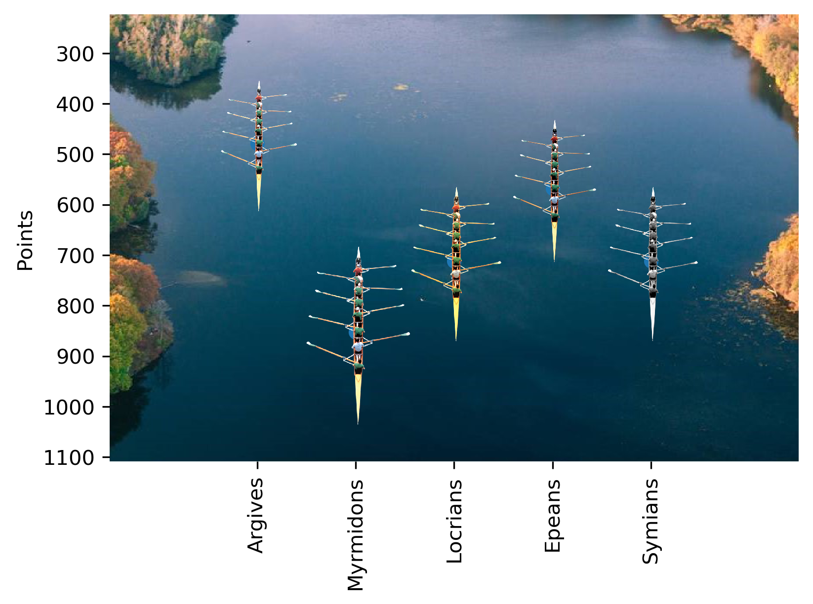

# Training Spreadsheet Race Simulator



The code in this repository was written to replace a 'graph style' representation of a training spreadsheet for a rowing club. Instead, images are generated that simulate the position of each team as a rowing boat.

It was designed to integrate with a Google Sheet containing all the competition data, and uploads the image regularly by a Raspberry Pi to a website online so that the =IMAGE() command in the Sheet can simply be updated.

# Setup

- A website to which the images can be sent using FTP
- Integration with Google Sheets including a credentials.json file and your key
- Images: boats (different colours of [this](https://www.pngwing.com/en/free-png-buqkk) used by the author) and any suitable river image into res directory
- The boatie.py script will need to be changed to meet the particular needs of your data/sheet

# Cron Job on Raspberry Pi

The following command should be scheduled to run on a Raspberry Pi regularly using
```angular2html
python src/boatie.py
```

